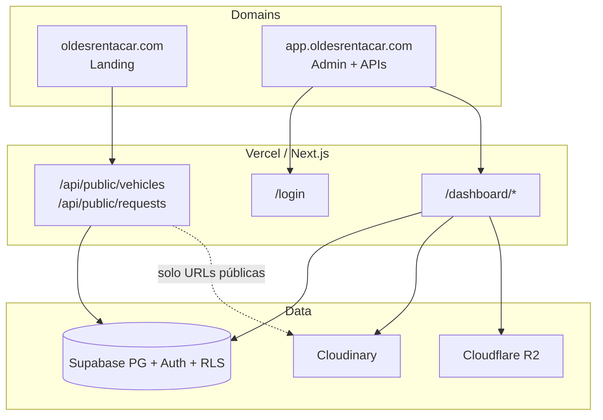

# Arquitectura definitiva — OLDES Rent-a-Car

**Estado:** arquitectura oficial del producto  
**Fecha:** 2026-07-27  
**Marca:** OLDES Rent-a-Car

---

## Visión general

```
                     OLDES RENT-A-CAR
               LANDING PAGE + SISTEMA WEB
                           │
                           ▼
                    NEXT.JS / VERCEL
                           │
          ┌────────────────┴────────────────┐
          │                                 │
          ▼                                 ▼
   LANDING PÚBLICA                  SISTEMA PRIVADO
   oldesrentacar.com                app.oldesrentacar.com
          │                                 │
   Catálogo vehículos                 Dashboard
   Formulario solicitud               Clientes / Reservas
   Información negocio                Cotizaciones / Contratos
   WhatsApp / Contacto                Inspecciones / Finanzas
                                      Mantenimiento / Reportes
                                      Usuarios / Roles
          │                                 │
          └────────────────┬────────────────┘
                           │
       ┌───────────────────┼────────────────────┐
       │                   │                    │
       ▼                   ▼                    ▼
   SUPABASE            CLOUDINARY          CLOUDFLARE R2
 PostgreSQL + Auth     Fotos públicas      Archivos privados
       │                   │                    │
       │                   ├── Vehículos        ├── Contratos PDF
       │                   ├── Portadas         ├── Cotizaciones PDF
       │                   ├── Galerías         ├── Firmas digitales
       │                   └── Miniaturas       ├── Inspecciones
       │                                        ├── Fotos de daños
       │                                        ├── Comprobantes
       │                                        └── Documentos
```

---

## Responsabilidad de cada servicio

| Servicio | Rol | Qué guarda / hace |
|----------|-----|-------------------|
| **Supabase** | Cerebro de datos | Datos estructurados, login, roles, permisos, RLS. **No** archivos pesados. |
| **Cloudinary** | Imágenes comerciales | Fotos de vehículos, portadas, galerías, miniaturas para Landing. |
| **Cloudflare R2** | Bodega privada | PDF, firmas, fotos de inspección, comprobantes, documentos. |
| **Vercel** | Runtime de la app | Landing + admin + APIs Next.js. |
| **Resend** | Correo (opcional) | Envío de cotizaciones / confirmaciones. |

### Supabase (detalle)

- Usuarios, roles, permisos  
- Clientes, solicitudes (`web_requests`)  
- Vehículos (**metadatos**, no binarios)  
- Cotizaciones / reservas / contratos (**datos**)  
- Inspecciones (**datos**)  
- Ingresos, gastos, depósitos  
- Mantenimiento, alertas, configuración, auditoría  

### Cloudinary (detalle)

- Solo assets **públicos/comerciales**  
- URLs que la Landing puede mostrar sin autenticación  

### Cloudflare R2 (detalle)

- Acceso privado / signed URLs  
- Nunca exponer PDFs ni firmas en CDN público permanente  

---

## Dominios preferidos (oficial)

| Dominio | Contenido |
|---------|-----------|
| `oldesrentacar.com` | Landing pública comercial |
| `app.oldesrentacar.com` | Sistema administrativo (`/login`, `/dashboard`) |
| `app.oldesrentacar.com/api/public/*` | APIs consumidas por la Landing |

> Alternativa válida (mismo proyecto Vercel): `oldesrentacar.com` + rutas `/login` y `/dashboard`.  
> **Preferencia OLDES:** subdominio `app.` para separar claramente marketing y software.

---

## Flujo de extremo a extremo

```
CLIENTE
   │
   ▼
LANDING OLDES (oldesrentacar.com)
   │
   ├──── Consulta vehículos ────► Next API ────► Supabase (metadatos)
   │                                              │
   │                                              └── URLs imágenes ──► Cloudinary
   │
   └──── Envía solicitud
              │
              ▼
         SUPABASE
      web_requests
        status = PENDING
      (NO crea reserva)
              │
              ▼
      SISTEMA ADMIN (app.oldesrentacar.com)
              │
              ▼
          Cliente
              │
              ▼
        Cotización
              │
              ├── PDF ───────────────► Cloudflare R2
              │
              ▼
        Confirmación
              │
              ▼
          Reserva  (aquí sí se bloquea calendario / overlap)
              │
              ▼
          Contrato
              │
              ├── PDF ───────────────► Cloudflare R2
              ├── Firmas ────────────► Cloudflare R2
              │
              ▼
        Inspección salida (CHECK_OUT)
              │
              ├── Fotos / daños ─────► Cloudflare R2
              │
              ▼
          Alquiler activo
              │
              ▼
       Inspección retorno (CHECK_IN)
              │
              ├── Fotos / daños ─────► Cloudflare R2
              │
              ▼
            Cierre
              │
              ▼
       Finanzas / Reportes (Supabase)
```

### Regla crítica

**Una solicitud de Landing ≠ reserva.**  
Solo `web_requests` con `PENDING`. La reserva nace tras cotización aceptada / confirmación administrativa.

---

## Diagrama técnico (Next.js)



---

## Almacenamiento — política de implementación

Orden de prioridad para archivos **privados**:

1. **Cloudflare R2** (definitivo / producción)  
2. Fallback temporal: Supabase Storage (si R2 no está configurado)  
3. Fallback de desarrollo: data URL (solo si no hay ningún storage)

Para imágenes de vehículos:

1. **Cloudinary** (definitivo)  
2. Mensaje claro si no está configurado (no romper la app)

---

## Seguridad

- Secretos solo server-side (`SUPABASE_SERVICE_ROLE_KEY`, R2 keys, Cloudinary secret, Resend).  
- Nunca `NEXT_PUBLIC_*` para secretos.  
- RLS en todas las tablas sensibles.  
- Permisos validados en UI + servidor + API + RLS.  
- APIs públicas: Zod, rate limit, honeypot, Origin (`LANDING_ALLOWED_ORIGIN`).  

---

## Futuro (APK Android)

Misma base:

- Misma BD Supabase  
- Mismos usuarios / roles / permisos  
- Mismos vehículos / clientes / reservas  
- Mismos archivos vía R2 / Cloudinary  

Sin reconstruir el núcleo.

---

## Documentos relacionados

- [DEPLOYMENT.md](./DEPLOYMENT.md) — Vercel + dominios  
- [EXTERNAL_SERVICES.md](./EXTERNAL_SERVICES.md) — credenciales  
- [API.md](./API.md) — endpoints públicos  
- [LANDING_INTEGRATION.md](./LANDING_INTEGRATION.md) — conexión Landing  
- [RBAC.md](./RBAC.md) / [RLS.md](./RLS.md)  
